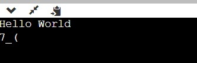

# Program 2
## Aim of the Experiment
Write a C Program that contains a string with a value 'Hello World'. The Program should AND or and  XOR each character in the string with 12 and displays th result.

### Output

